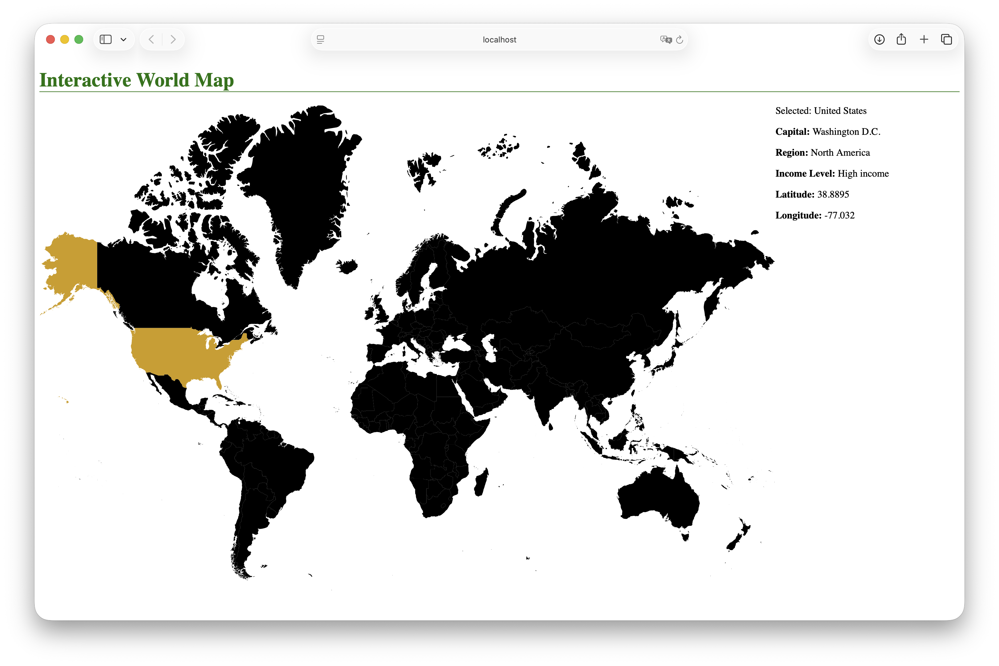
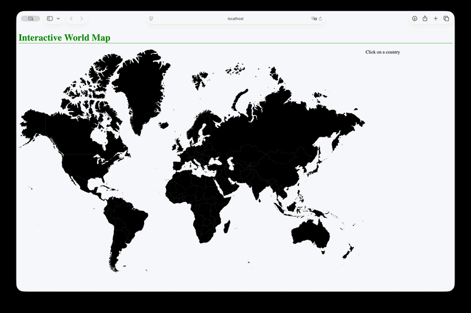

# World Map API Angular App

## Overview
This project is an Angular-based web application that interacts with a world data API to display information about countries. It provides an interactive way to explore global data such as country names, regions, and other geographic or demographic details.


This project was built as part of a learning experience to strengthen skills in:
- Angular development
- API integration
- Frontend design and responsiveness
  
## Screenshots and Demo



## Features
- Display country data from an external API  
- Search and filter countries  
- View detailed country information  
- Responsive UI for different screen sizes  
- Dynamic data fetching using HTTP requests  


## Tech Stack
- **Frontend:** Angular  
- **Language:** TypeScript, HTML, CSS  
- **Package Manager:** npm  
- **Build Tool:** Angular CLI  


## Environment / Versions
- Angular: 19.2.15  
- Angular CLI: 19.2.15  
- Node.js: v22.16.0  
- npm: 11.4.2  
- OS: macOS 26

## Installation & Setup

1. Clone the repository
```bash
git clone https://github.com/icozm/world-map-api-angular.git
cd world-map-api-angular
```

2. Install Dependencies
```bash
npm install
```

3. Run the application
```bash
ng serve
```

4. Open in browser
```bash
http://localhost:4200
```

## API Usage
This project consumes a public country API to fetch data dynamically.
- Country Name
- Capital
- Region
- Income Level
- Latitude
- Longitude

## Future Improvements
- Favorite/save countries feature
- Improve mobile responsiveness
- Dark mode support

## Author
- Ivan Cozmulici
- GitHub:
```bash
https://github.com/icozm
```
